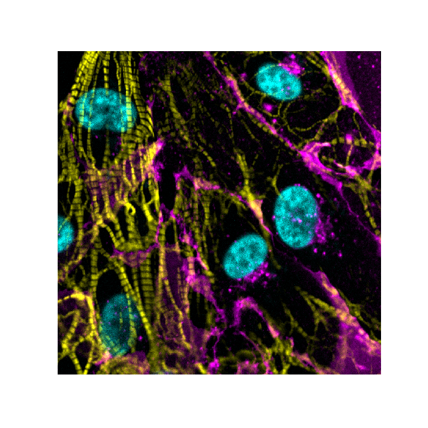

# aicspylibczi
[](https://github.com/AllenCellModeling/pylibczi/actions)
[](https://github.com/AllenCellModeling/pylibczi/actions)
[](https://codecov.io/gh/AllenCellModeling/pylibczi)
[](https://www.gnu.org/licenses/gpl-3.0)


Python module to expose [libCZI](https://github.com/zeiss-microscopy/libCZI) functionality for reading (subset of) Zeiss CZI files and meta-data.

## Usage

The first example show how to work with a standard CZI file (Single or Multe-Scene). The second example shows how to work with a Mosaic CZI file.

#### Example 1:  Read in a czi and select a portion of the image to display
```python
import numpy as np
from aicspylibczi import CziFile
from pathlib import Path
from PIL import Image

pth = Path('20190610_S02-02.czi')
czi = CziFile(pth)

# Get the shape of the data, the coordinate pairs are (start index, size)
dimensions = czi.dims_shape()  # {'Z': (0, 70), 'C': (0, 2), 'T': (0, 146), 'S': (0, 12), 'B': (0, 1)}

czi.dims  #  BSTCZYX

czi.size  #  (1, 12, 146, 2, 70, 1300, 1900) 

# Load the image slice I want from the file
img, shp = czi.read_image(S=13, Z=16)

# shp = [('B', 1), ('S', 1), ('C', 4), ('Z', 1), ('Y', 1300), ('X', 1900)]  # List[(Dimension, size), ...] 
# img.shape = (1, 1, 4, 1, 1300, 1900)   # numpy.ndarray

# define helper functions
def norm_by(x, min, max):
    norms = np.percentile(x, [min, max])
    i2 = np.clip((x - norms[0])/(norms[1]-norms[0]), 0, 1)
    i2
    return i2

def recolor(im): # transform from rgb to cyan-magenta-yellow
    im_shape = np.array(im.shape)
    color_transform = np.array([[1, 1, 0], [0, 1, 1], [1, 0, 1]]).T
    im_reshape = im.reshape([np.prod(im_shape[0:2]), im_shape[2]]).T
    im_recolored = np.matmul(color_transform.T, im_reshape).T
    im_shape[2] = 3
    im = im_recolored.reshape(im_shape)
    return im

#normalize, combine into RGB and transform to CMY
c1 = (norm_by(img[0, 0, 0, 0, 0:750, 250:1000], 50, 99.8)*255).astype(np.uint8)
c2 = (norm_by(img[0, 0, 1, 0, 0:750, 250:1000], 50, 99.8)*255).astype(np.uint8)
c3 = (norm_by(img[0, 0, 2, 0, 0:750, 250:1000], 0, 100)*255).astype(np.uint8)
rgb = np.stack((c1, c2, c3), axis=2)
cmy = np.clip(recolor(rgb), 0, 255)

# plot using matplotlib¶
plt.figure(figsize=(10,10))
plt.imshow(cmy)
plt.axis('off')
```


#### Example 2:  Read in a mosaic file 
```python
import numpy as np
import aicspylibczi
import pathlib
from PIL import Image

mosaic_file = pathlib.Path('~/Data/20190618_CL001_HB01_Rescan_002.czi').expanduser()
czi = aicspylibczi.CziFile(mosaic_file)

# Get the shape of the data
dimensions = czi.dims   #  'STCZMYX'

czi.size  # (1, 1, 1, 1, 2, 624, 924)

czi.dims_shape()  # {'C': (0, 0), 'M': (0, 1), 'S': (0, 0), 'T': (0, 0), 'X': (0, 923), 'Y': (0, 623), 'Z': (0, 0)}

czi.is_mosaic()  # True 
 # Mosaic files ignore the S dimension and use an internal mIndex to reconstruct, the scale factor allows one to generate a manageable image
mosaic_data = czi.read_mosaic(C=0, scale_factor=1) 

mosaic_data.shape  #  (1, 1, 624, 1756)
 # the C channel has been specified S & M are used internally for position so this is (T, Z, Y, X)

normed_mosaic_data = norm_by(mosaic_data[0, 0, :, :], 5, 98)*255
img = Image.fromarray(normed_mosaic_data.astype(np.uint8))
```


## Installation

The preferred installation method is with `pip install`.
This will install the aicspylibczi python module and extension binaries ([hosted on PyPI](https://pypi.org/project/aicspylibczi/)):

`
pip install aicspylibczi
`

## Documentation

Documentation is available at 
[github.io](https://allencellmodeling.github.io/pylibczi) and 
[readthedocs](https://aicspylibczi.readthedocs.io/en/latest/index.html). 

## Build

Use these steps to build and install aicspylibczi locally:

* Clone the repository including submodules (`--recurse-submodules`).
* Requirements:
  * libCZI requires a c++11 compatible compiler. Built & Tested with clang.
  * Development requirements are those required for libCZI: **libpng**, **zlib**
  * Install the package:
    ```
    pip install .
    pip install -e .[dev] # for development (-e means editable so changes take effect when made)
    pip install .[all] # for everything including jupyter notebook to work with the Example_Usage above
    ```
  * libCZI is automatically built as a submodule and linked statically into aicspylibczi.
* Note: If you get the message directly below on windows you need to set PYTHONHOME to be the folder the python.exe you are compiling against lives in.
 ```
EXEC : Fatal Python error : initfsencoding: unable to load the file system codec ... 
ModuleNotFoundError: No module named 'encodings'
``` 


## License

The GPLv3 license is a consequence of libCZI which imposes GPLv3. If you wish to use libCZI or this derivative in
a commercial product you'll need to talk to Zeiss.
